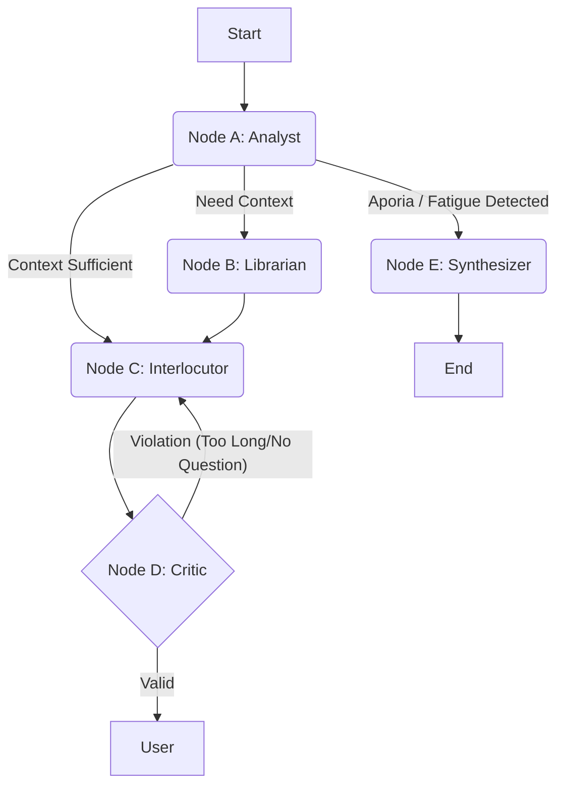

# Feature Spec: Sophia Architecture V2 (The Maieutic State Machine)

**Feature:** Socratic State Machine & Dialectic Logic  
**Status:** Draft  
**Owner:** Brandon Wood  
**Supersedes:** `context/specs/langgraph_agent.md`, `context/specs/authoritative_agent.md`  

## 1. Vision & Purpose
To transition Sophia from a stateless "Linear RAG Chain" into a **state-aware Socratic Interlocutor**. 

Unlike standard assistants that optimize for *Answer Satisfaction*, Sophia optimizes for **Dialectic Depth**. She uses a multi-node reasoning graph to track the user's logical premise, apply "Good Will" (Maieutics), and guide the conversation toward *Aporia* (productive confusion) or *Synthesis* (clarity).

## 2. Core Architecture

### 2.1 The "Spiral" Graph
We replace the linear `Retrieve -> Generate` loop with a **State Machine** that separates "Thinking" (Logic Tracking) from "Speaking" (Response Generation).



### 2.2 The Graph State (`AgentState`)

The state object is the "memory" of the conversation's logical structure, not just its text.

```typescript
interface AgentState {
  // Standard LangChain History
  messages: BaseMessage[];
  
  // Logic Tracking (The "Thesis")
  current_thesis: string;          // The user's specific claim (e.g., "Justice is fairness")
  thesis_evolution: string[];      // Log of how the definition has shifted
  
  // Meta-Data (The "Vibe")
  user_sentiment: "curious" | "defensive" | "fatigued";
  frustration_level: number;       // 0-10, triggers "Good Will" override
  
  // Operational
  socratic_move: "ELICIT" | "EXAMINE" | "CHALLENGE" | "CONCEDE" | "SYNTHESIZE";
  search_query: string;            // Synthesized query (not raw user text)
  documents: Citation[];           // Grounding artifacts
  
  // Safety
  critic_failures: number;         // To prevent infinite loops in Node D
}

```

---

## 3. Node Specifications

### Node A: The Analyst (The "Brain")

* **Model:** Gemini 3.0 Flash (Low latency, high instruction following). (gemini-3-flash-preview)
* **Role:** OODA Loop "Orientation." It does not speak to the user.
* **Input:** Chat History.
* **Logic:**
1. **Extract Thesis:** Convert "No, that's wrong" into "Thesis: The previous definition of virtue is insufficient because..."
2. **Sentiment Check:** If `frustration_level > 7`, force `socratic_move` to `ELICIT` (gentle scaffolding) instead of `CHALLENGE`.
3. **End-Game Detection:** If the user admits ignorance ("I don't know") or the argument circles 3 times, set `move` to `SYNTHESIZE`.


* **Output:** Updates `current_thesis`, `socratic_move`, `search_query`.

### Node B: The Librarian (The "Tool")

* **Model:** None (Vertex AI Tool).
* **Role:** High-fidelity retrieval.
* **Input:** `search_query` (from Node A).
* **Logic:**
* Executes Vector Search against the Ancient Canon index.
* **Filter:** Discards results with < 0.75 similarity.
* **Formatting:** Appends strict JSON citations to `documents` state.


### Node C: The Interlocutor (The "Voice")

* **Model:** Gemini 3 pro (gemini-3-pro-preview)
* **Role:** Generates the text response.
* **System Prompt "The Maieutic Standard":**
> "You are Sophia. You are not a debater; you are a midwife for ideas.
> **Rule 1 (Steel-Man):** Before challenging, you must state the user's argument better than they did.
> **Rule 2 (Brevity):** Never exceed 3 sentences.
> **Rule 3 (The Question):** Every turn must end with a question grounded in the text."


* **Input:** `current_thesis`, `documents`, `socratic_move`.

### Node D: The Critic (The "Guardrail")

* **Model:** Gemini 3.0 Flash (gemini-3-flash-preview)
* **Role:** Quality Control.
* **Logic:**
* **Check 1:** Is length > 4 sentences?
* **Check 2:** Does it end with a `?`?
* **Check 3:** If `documents` were present, is there a `` tag?


* **Action:** If Fail, pass back to Node C with error instruction: "Too long. Cut to 1 sentence."

### Node E: The Synthesizer (The "Closer")

* **Model:** Gemini 3 pro (gemini-3-pro-preview)
* **Role:** Provides closure when the dialogue reaches *Aporia*.
* **Trigger:** `socratic_move === "SYNTHESIZE"`.
* **Output:**
* A summary of the "Arc" (Where we started vs. where we ended).
* A "Myth" or "Analogy" from the Canon to hold the complexity.
* **Reading List:** 2-3 specific texts for further study.
* *No final question.* (The session ends).


## 4. Key Workflows

### 4.1 The "Good Will" Override

**Scenario:** User gets annoyed ("Stop asking me trick questions!").

1. **Node A:** Detects `user_sentiment: "defensive"`.
2. **Node A:** Sets `socratic_move: "CONCEDE"` (Validate).
3. **Node C:** Receives instruction: *Do not use Socratic Irony. Speak plainly.*
4. **Output:** "You are right to be frustrated; these questions are difficult. Let us simplify..."

### 4.2 The "Garbage-In" Fix

**Scenario:** User says "Why?"

1. **Node A:** Sees `last_message: "Why?"` + `current_thesis: "Justice is fairness"`.
2. **Node A:** Synthesizes `search_query: "Philosophical arguments against Justice as Fairness"`.
3. **Node B:** Searches for the *concept*, not the word "Why."
